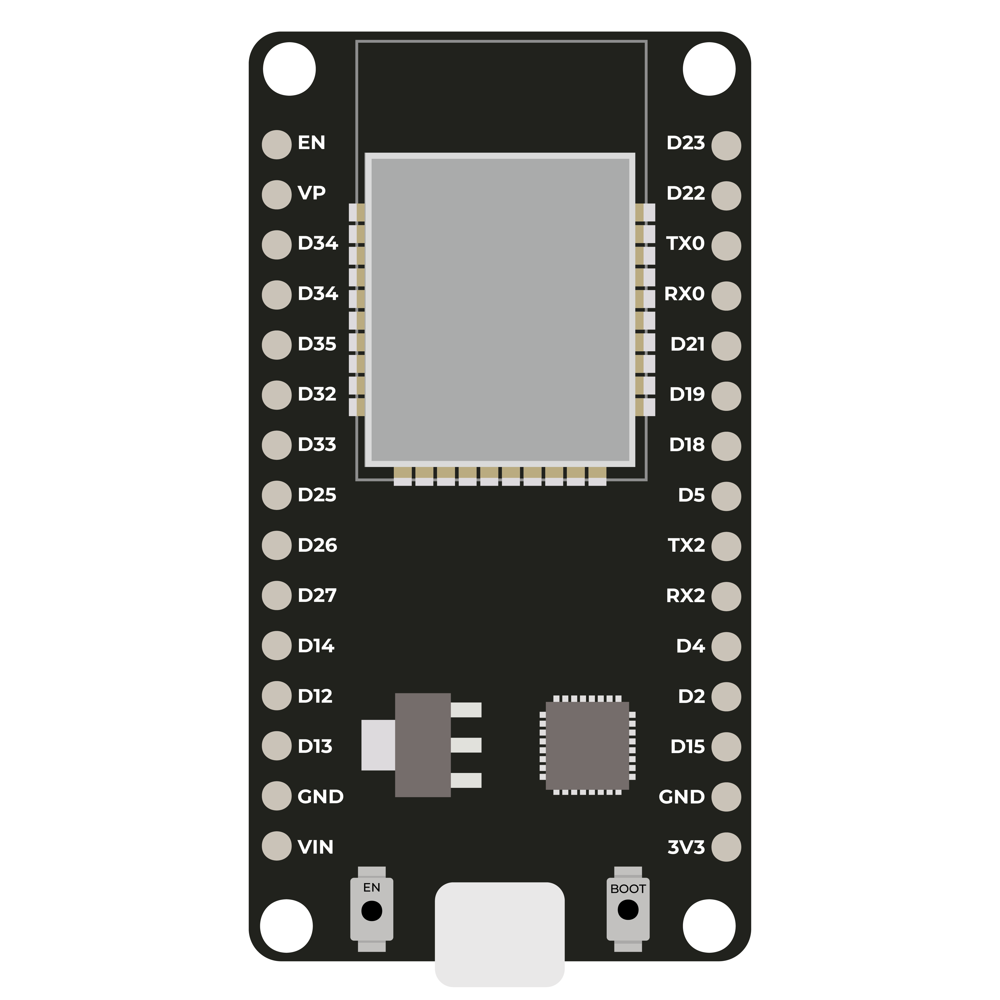

# ESP32 Pin Configurator

Interactive web-based tool for configuring ESP32 GPIO pins.

## Overview
This project provides a visual ESP32 pinout interface that allows
users to select GPIO pins and configure their functionality
(ADC, DAC, PWM, GPIO, SPI, I2C).

The configuration is intended to be sent to an ESP32 board via
Serial communication.

## Features
- Interactive ESP32 pinout
- Pin information tooltips
- Input / Output mode selection
- ADC, DAC, PWM configuration
- Parameter configuration (frequency, duty cycle, DAC value)
- Example session export (CSV)

## Tech Stack
- ESP32
- Arduino IDE (C/C++)
- HTML5
- CSS3
- Vanilla JavaScript
- Serial communication (USB)

## Project Structure
/arduino → ESP32 firmware (Arduino sketch)
/index.html → Web UI
/script.js → Application logic
/style.css → Styling

## Preview

